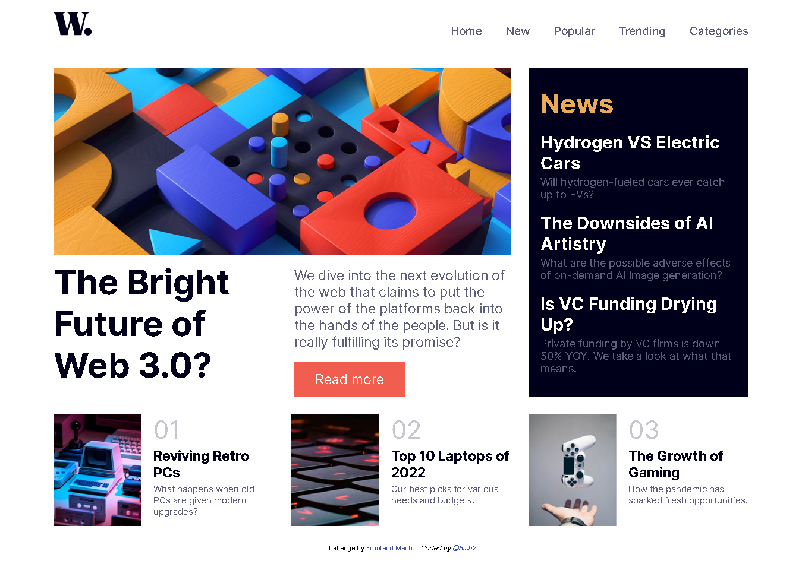

# Frontend Mentor - News homepage solution

This is a solution to the [News homepage challenge on Frontend Mentor](https://www.frontendmentor.io/challenges/news-homepage-H6SWTa1MFl). Frontend Mentor challenges help you improve your coding skills by building real projects. 

## Table of contents

- [Overview](#overview)
  - [The challenge](#the-challenge)
  - [Screenshot](#screenshot)
  - [Links](#links)
- [My process](#my-process)
  - [Built with](#built-with)
  - [What I learned](#what-i-learned)
  - [Continued development](#continued-development)
  - [Useful resources](#useful-resources)
- [Author](#author)
- [My recent works](#My-recent-works)
- [Acknowledgments](#acknowledgments)

## Overview

### The challenge

Users should be able to:

- View the optimal layout for the interface depending on their device's screen size
- See hover and focus states for all interactive elements on the page

### Screenshot



### Links

- Solution URL: [Check out my solution](https://github.com/Binh2/news-homepage)
- Live Site URL: [My live webpage](https://binh2.github.io/news-homepage/)

## My process

Still has the same workflow (sketch on Figma and make a page using HTML, CSS and JS). But this time with a little twist, I tried to make the page with only HTML and CSS.

1. Sketch this news homepage on Figma. But, I can't show it because of copyright, maybe.
2. Add sectioning tags to HTML content, styling using CSS, and replace all JS code with CSS (probably, a bad idea).
3. Fix up odd CSS styling errors.
4. Get feedback from other people.

### Built with

- Semantic HTML5 markup
- CSS custom properties
- Flexbox
- CSS Grid
- Responsive web design

### What I learned

I learn a lot from doing this project. It's a lot so I gonna outline some of the uncommon lessons I learn.

```html
</img>
<!-- The width and height are the original image side and when used, will speed up the browser loading time -->
```

```css
.news { /* Use rem for the component container */
  font-size: 1.5rem;
}
.news h1 { /* Use em for each part in the component */
  font-size: 2em;
}
.news p { /* Use em for each part in the component */
  font-size: 0.8em;
}
```

```css
/* This part should have been JS code that I learn, but now, it's being replaced by CSS that I learn */
.hamburger-checkbox {
  display: none; /* hide element, element doesn't take up space and no event handling */
  visibility: hidden; /* hide element, element takes up space and no event handling */
  opacity: 0; /* hide element, element takes up space and have event handling */
```

### Continued development

To be honest, this project still needs a lot of revisions. I'm just going to outline some of the ones I know:

- I need to change some of the CSS -> JS (because it will become easier to develop and fix errors)
- The page still has scrolling (I think I need to make the page smaller so there are no scrollbar)
- When the hamburger menu is opened, if the browser is resized to a desktop width, the news homepage layout will start to break apart.
- When a user uses `Ctrl` + `-` to scale down the browser, the text will get smaller but the image tried to grow to take up available space (I want the image to shrink, not grow).

### Useful resources

I look up a lot of resources when I was doing this project but I forgot to save most of them. :sweat_smile:

- [Hiding and styling checkbox](https://www.sarasoueidan.com/blog/inclusively-hiding-and-styling-checkboxes-and-radio-buttons/)

## Author

- Frontend Mentor - [@Binh2](https://www.frontendmentor.io/profile/Binh2)
- Twitter - [@hgqbinh2002](https://twitter.com/hgqbinh2002)
- LinkedIn - [hgqbinh2002](https://www.linkedin.com/in/hgqbinh2002/)

## My recent works

### QR code component (version 1)

- Solution URL: [Checkout my solution](https://github.com/Binh2/qr-code-component)
- Live Site URL: [My live webpage](https://binh2.github.io/qr-code-component/)

## QR code component (version 2)

- Solution URL: [Checkout my solution](https://github.com/Binh2/qr-code-component-v2)
- Live Site URL: [My live webpage](https://binh2.github.io/qr-code-component-v2/)

## Acknowledgments

Big thanks to Frontend Mentor to give me the idea to do this project.
Big thanks to myself to have the motivation to finish my second project
